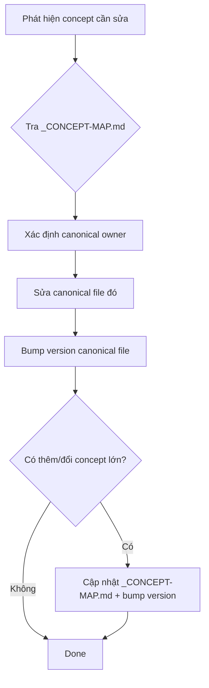

# 🗺️ Concept Map — Single Source of Truth (SSOT)

> **Tác giả:** Mr.Rom\
> **Phiên bản:** v1.1.0\
> **Tạo lúc:** 15/05/2026\
> **Cập nhật:** 01/06/2026

> 🎯 *File này declare **canonical owner** cho mọi concept trong Blueprint. Khi cần biết "concept X định nghĩa ở đâu" → tra map này. Khi muốn sửa concept → chỉ sửa canonical + bump version của file đó.*

> ⚠️ **Quy tắc vàng**: nếu concept đã có canonical, các file khác chỉ được **tóm tắt 1-2 dòng + link** tới canonical. KHÔNG được lặp full definition.

---

## 1️⃣ Bản đồ concept → file canonical

| # | Concept | Canonical owner | Files có quyền link tới (không lặp def) |
|---|---|---|---|
| 1 | **Tầm nhìn, audience, phạm vi kho** | `../_idea-overview.md` (foundation — frozen) | Mọi file |
| 2 | **Sitemap L1 16 chủ đề (bảng tổng)** | `../_idea-overview.md` §"Sitemap Level 1" | `01_sitemap-detail.md` chỉ link |
| 3 | **Sitemap chi tiết L2 + L3-L4 cho mọi chủ đề** | `01_sitemap-detail.md` §2-§3 | (canonical) |
| 4 | **Menu 7 loại nội dung** (lessons/setup/exercises/projects/recipes/cheatsheet/glossary) | `02_folder-structure.md` §3 | `01_sitemap-detail.md` §0.2 chỉ link |
| 5 | **L1 meta slots** (`_notes/`, `_concepts/`, `_capstone-projects/`) | `02_folder-structure.md` §2 | `01_sitemap-detail.md` §0.4 chỉ link |
| 6 | **Cấu trúc folder mọi cấp (root → L4)** | `02_folder-structure.md` | Mọi file link |
| 7 | **Naming prefix mọi cấp** (`_`, `NN_`, `99_`, `00_`) | `02_folder-structure.md` | `02_folder-structure.md` §5 chỉ link |
| 8 | **Khung 8 phần bài học** (REQUIRED/OPTIONAL) | `03_writing-style.md` §1 | `templates/lesson_template.md` là *instance*, không spec |
| 9 | **Metadata header format** (Tác giả, version, level, ...) | `03_writing-style.md` §2.1 | Mọi file link |
| 10 | **WHY → WHAT → HOW framework** | `03_writing-style.md` §2.3 | Templates apply |
| 11 | **Văn phong, câu dẫn liền mạch** | `03_writing-style.md` §3 | Mọi file link |
| 12 | **Diagram & visualization** (mermaid, ASCII) | `03_writing-style.md` §4 | Mọi file link |
| 13 | **Bộ emoji nhất quán** (section + inline) | `03_writing-style.md` §5 | `README.md` §6 chỉ link |
| 14 | **Code blocks, tables, lists, links cú pháp** | `03_writing-style.md` §6-§10 | Mọi file link |
| 15 | **Link strategy: internal, anchor, external, wiki** | `05_linking-strategy.md` §2 | Mọi file link |
| 16 | **Cross-L2 reference 3 case (A/B/C)** | `05_linking-strategy.md` §3 | `01_sitemap-detail.md` §0.3 chỉ link |
| 17 | **Navigation footer chuẩn** | `05_linking-strategy.md` §4 | Mọi file link |
| 18 | **Glossary 3 cấp** (bài → L2 → L1) | `05_linking-strategy.md` §5 | Mọi file link |
| 19 | **Roadmap design + 2 loại** (career + lab-series) | `06_roadmap-design.md` | `01_sitemap-detail.md` §2.0 chỉ link |
| 20 | **Roadmap template** | `06_roadmap-design.md` §3-§4 + `templates/roadmap_template.md` | (canonical) |
| 21 | **Quality checklist** | `07_quality-checklist.md` | Mọi file link |
| 22 | **MUST-KNOW level tag** | `03_writing-style.md` §2.1 | (đã thêm v0.2.0) |
| 23 | **MASTER-CATALOG.md spec** | `02_folder-structure.md` §1 (root structure) | `templates/master-catalog_template.md` là instance |
| 24 | **CONTRIBUTING.md spec** | `02_folder-structure.md` §1 (root structure) | `templates/contributing_template.md` là instance |
| 25 | **Ẩn dụ (metaphor) bắt buộc trong WHAT** | `03_writing-style.md` §2.3 | (mới v0.4.0) |
| 26 | **Reference workflow** — cherry-pick ý hay từ `_Ref/`, KHÔNG migrate | `07_quality-checklist.md` §15 | (v0.3.0) |
| 27 | **`02_tools/` Central Setup Hub** — canonical cho mọi install chi tiết cross-cutting tools; lessons L1 khác chỉ giới thiệu + link | `02_folder-structure.md` §3.2bis | (mới v0.3.0) |
| 28 | **Setup template** (9 section chi tiết) | `templates/setup_template.md` | (mới — instance, không spec) |
| 29 | **Phân biệt Intro vs Lesson chi tiết** — tránh lẫn lộn 2 vai trò trong 1 bài | `02_folder-structure.md` §3.0 | (mới v0.4.0) |
| 30 | **Scope của 02_tools** — chứa gì (setup + tool features), KHÔNG chứa gì (lệnh OS thuộc 04_os) | `02_folder-structure.md` §3.2ter | (mới v0.5.0) |
| 31 | **De-meta — vùng cấm file học** (không lộ ngôn ngữ/đối tượng/phương pháp/Mr.Rom-thân-bài/link _blueprint) | `03_writing-style.md` §3.15 | `07_quality-checklist.md` §De-meta link |
| 32 | **Changelog tăng dần** (cũ→mới) — override global skill (reverse-chronological) | `07_quality-checklist.md` | README §6 + mọi file ghi note |
| 33 | **KHÔNG dùng ước tính thời gian** (reading-time / tháng-tuần-giờ / phút làm bài) | `07_quality-checklist.md` §De-meta | `03_writing-style.md` §1 |
| 34 | **Heading chuẩn + nav 3-sub** (Glossary/Changelog song ngữ; Liên kết 🧭/🧩/🌐; nav ⬅️/➡️/↑ link-text=tiêu đề) | `03_writing-style.md` §2.7–2.8 | `05_linking-strategy.md` §4 |

## 2️⃣ Quy trình khi sửa Blueprint

> ⚠️ **KHÔNG** sửa các file non-canonical — chúng chỉ chứa link. Sửa sai sẽ tạo drift.

## 3️⃣ Quy trình khi thêm concept mới

1. Quyết định file nào nên là canonical owner (dựa trên scope)
2. Viết concept đầy đủ trong canonical file
3. Cập nhật `_CONCEPT-MAP.md` thêm dòng mới
4. Các file khác cần dùng concept → chỉ link tới canonical

## 4️⃣ Khi nào cần tạo file mới trong Blueprint

Chỉ tạo file mới khi có **nhóm concept lớn** không thuộc 7 file hiện có:
- `README.md` — meta về Blueprint
- `01_sitemap-detail.md` — bản đồ kho
- `02_folder-structure.md` — cấu trúc folder/file & quy ước đặt tên (đã gộp)
- `03_writing-style.md` — viết content
- `05_linking-strategy.md` — link/glossary
- `06_roadmap-design.md` — roadmap
- `07_quality-checklist.md` — soát chất lượng

Nếu concept mới rơi vào 1 trong 7 mảng trên → thêm section vào file đó, không tạo file mới.

---

## 📌 Nhật ký thay đổi (Changelog)

> 📌 Thứ tự **tăng dần** (cũ → mới) — repo này override global skill `naming/metadata-headers.md` (global mặc định reverse-chronological).

- **v0.1.0 (15/05/2026)** — Bản đầu tiên. Map 24 concept → canonical owner. Quy trình sửa/thêm.
- **v0.2.0 (16/05/2026)** — Thêm 2 concept mới:
  - #25: Metaphor rule (canonical `03_writing-style.md` §2.3)
  - #26: Migration workflow *(đã rename ở v0.3.0)*
- **v0.3.0 (16/05/2026)** — Rename #26 từ "Migration workflow" → "**Reference workflow**" sau feedback user. `_Ref/` là REFERENCE cherry-pick, không phải migration source.
- **v0.4.0 (16/05/2026)** — Thêm 2 concept:
  - #27: `02_tools/` Central Setup Hub (canonical `02_folder-structure.md` §3.2bis)
  - #28: Setup template (canonical `templates/setup_template.md`)
- **v0.5.0 (16/05/2026)** — Thêm #29: Phân biệt Intro vs Lesson chi tiết (canonical `02_folder-structure.md` §3.0).
- **v0.6.0 (16/05/2026)** — Thêm #30: Scope của 02_tools (canonical `02_folder-structure.md` §3.2ter).
- **v1.0.0 (26/05/2026)** — **Tái cấu trúc lớn (Đồng bộ hóa gộp file)**:
  - Cập nhật danh sách file Blueprint còn 7 file chính sau khi gộp Quy ước đặt tên (`04_naming-convention.md`) vào `02_folder-structure.md`.
- **v1.1.0 (01/06/2026)** — Đổi heading changelog sang song ngữ + đảo thứ tự tăng dần (đồng bộ quyết định A toàn repo). Thêm concept #31–#34 cho các quy ước chốt phiên 01/06 (de-meta, changelog tăng dần, bỏ ước tính thời gian, heading chuẩn + nav 3-sub).
