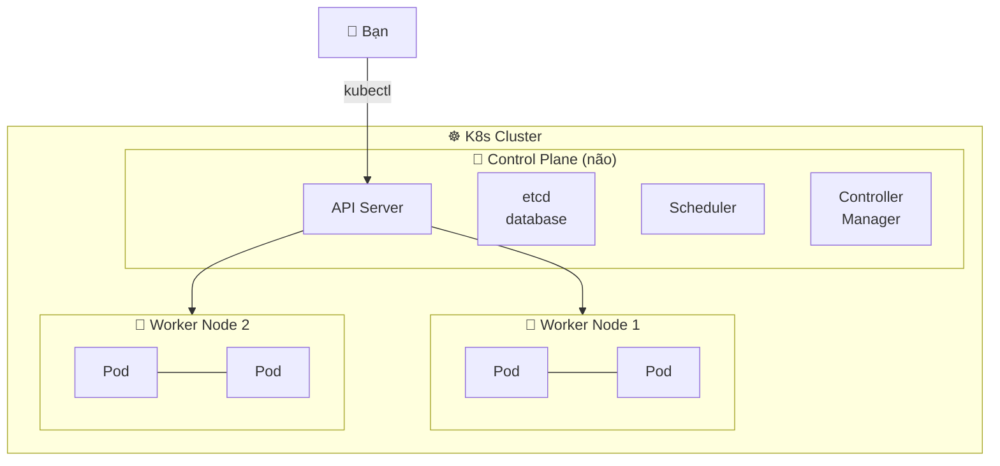

# 🎓 K8s là gì? — Đơn vị điều phối container

> **Tác giả:** Mr.Rom\
> **Phiên bản:** v1.1.0\
> **Tạo lúc:** 19/05/2026\
> **Cập nhật:** 01/06/2026\
> **Level:** Basic\
> **Tags:** [MUST-KNOW]\
> **Yêu cầu trước:** Đã hoàn thành [bộ Docker basic](../../10_devops/docker/lessons/01_basic/)

> 🎯 *Trước đây bạn đã biết Docker bật/tắt vài container thủ công. Bài này dẫn bạn vào thế giới điều phối hàng nghìn container — K8s là gì, sinh ra để giải quyết gì, và làm thử cluster đầu tiên ngay trên máy mình.*

## 🎯 Sau bài này bạn sẽ

- [ ] Hiểu vì sao Docker thuần không đủ khi app có > 50 service
- [ ] Định nghĩa được K8s + 3 năng lực cốt lõi
- [ ] Vẽ được sơ đồ phân tầng: Cluster → Node → Pod → Container
- [ ] Chạy được cluster K8s đầu tiên ở máy mình bằng Minikube

---

## Tình huống — vì sao bạn cần đọc tiếp

Bạn đã quen Docker, biết bật vài service bằng `docker compose up`. Trong bài tập của ta, app thường chỉ có 3-5 container — frontend, backend, database, redis, nginx. Dễ quản, dễ debug.

Nhưng **app thật ngoài đời** không vậy.

Hãy thử nghĩ:
- **Netflix** chạy ~**1000+ microservice**, mỗi cái có hàng chục replica
- **Twitter** xử lý ~500 triệu tweet/ngày — hàng chục nghìn container song song
- **Shopee** mùa sale 11.11 — auto scale từ 2000 lên 8000 container trong 1 tiếng

Giờ tưởng tượng bạn là DevOps duy nhất của Shopee. **3h sáng**, 1 container backend chết. Bạn có:

- 🤔 Biết container nào chết trong 8000 con đang chạy không?
- 🤔 Khởi động lại trong < 5 giây không, hay phải ngồi gõ `docker run` thủ công?
- 🤔 Đảm bảo traffic không đổ vào container chết không?
- 🤔 Lúc mainsale, scale 2000 → 8000 trong 1h — đủ thời gian bấm tay không?

Chắc chắn **không**. Sức người không kham nổi.

→ Vì thế năm 2014, Google open source **Kubernetes** (K8s) — đã dùng nội bộ Google 15 năm dưới tên *Borg* — để cộng đồng có thứ tự động hoá toàn bộ phần "khổ" này.

---

## 1️⃣ Vậy K8s là gì?

**Định nghĩa chính thức**: Kubernetes là một hệ thống *container orchestration* mã nguồn mở — tự động hoá việc deploy, scale, và quản lý vòng đời container ở quy mô lớn.

🪞 **Ẩn dụ đời thường**: K8s giống như **người quản lý 1 chung cư 1000 căn hộ**. Bạn (developer) chỉ cần báo: *"Tôi muốn lúc nào cũng có đúng 50 căn cho dịch vụ A, 30 căn cho dịch vụ B"*. K8s tự lo:
- Phòng nào hỏng → sửa hoặc thay phòng mới
- Khách (request) tới → dẫn vào phòng còn trống
- Mùa cao điểm → mở thêm tầng
- Mùa thấp điểm → đóng bớt phòng tiết kiệm điện

Bạn không cần biết cụ thể "phòng 503 tầng 12 đang sửa" — chỉ cần "luôn có 50 căn dịch vụ A sẵn sàng". Đó là tinh thần **declarative** của K8s.

---

## 2️⃣ Nó làm được gì?

Quay lại tình huống Shopee 3h sáng:

| Vấn đề | K8s giải quyết |
|---|---|
| Container chết giữa đêm | Tự `restart` con mới trong < 3 giây qua `Deployment` |
| 8000 container — không biết con nào chết | `kubectl get pods` show tất cả status realtime |
| Traffic đổ vào container chết | `Service` + health check loại nó khỏi pool ngay |
| Mainsale scale 2000 → 8000 | `HorizontalPodAutoscaler` tự scale theo CPU/RAM |
| Deploy v2 không downtime | `Rolling update` — thay từng nhóm, lỗi thì auto rollback |

**Ngoài ra còn:**

- **Self-healing** — Pod chết tự sinh con mới, node hỏng tự reschedule sang node khác
- **Service discovery** — service tìm nhau qua DNS, không cần biết IP
- **Secret/Config management** — không hardcode password vào code
- **Multi-cloud** — chạy được trên AWS, GCP, on-prem — code không đổi

---

## 3️⃣ Bên dưới K8s ngầm chạy gì?

K8s không phải "1 phần mềm" — nó là **1 cụm máy** (cluster) có 2 loại node làm 2 vai khác nhau:



| Thành phần | Vai trò | Ẩn dụ |
|---|---|---|
| **Control Plane** | "Não" — quyết định việc | Quản lý chung cư |
| API Server | Cổng giao tiếp duy nhất | Bàn lễ tân |
| etcd | DB lưu state cluster | Sổ ghi chép phòng nào ai ở |
| Scheduler | Quyết Pod chạy ở Node nào | Người xếp khách vào phòng |
| Controller | Đảm bảo desired state | Kỹ thuật viên đi tuần |
| **Worker Node** | "Tay chân" — chạy Pod | Tầng nhà thật |

Bạn không gõ lệnh trực tiếp lên Worker. Mọi thứ đi qua **API Server** bằng `kubectl`.

---

## 4️⃣ Làm sao thử K8s ở local?

Production K8s thường chạy nhiều máy. Để học, ta dùng **local cluster** chạy trong 1 máy. 3 lựa chọn phổ biến:

| Tool | Khi nào pick |
|---|---|
| **Minikube** | Beginner, đa nền tảng, ổn định |
| **Kind** | CI/CD, K8s trong Docker (nhanh) |
| **k3d** | Lightweight, learning + IoT |

→ Bài này dùng Minikube. So sánh chi tiết → [02_tools/k8s-local/00_local-k8s-options.md](../../02_tools/k8s-local/).

### Setup tối thiểu cho bài này

```bash
# 1. Cài Minikube (macOS)
brew install minikube

# 2. Khởi cluster
minikube start

# 3. Verify
kubectl get nodes
```

Kết quả mong đợi:

```
NAME       STATUS   ROLES           AGE   VERSION
minikube   Ready    control-plane   30s   v1.28.3
```

> 💡 Muốn cấu hình Minikube sâu hơn (CPU, RAM, driver, addon) → xem [02_tools/k8s-local/minikube.md](../../02_tools/k8s-local/).

### Chạy Pod đầu tiên

```bash
kubectl run nginx --image=nginx:1.25
kubectl get pods
```

Kết quả:

```
NAME    READY   STATUS    RESTARTS   AGE
nginx   1/1     Running   0          10s
```

🎉 Container đầu tiên của bạn đang chạy dưới sự bảo vệ của K8s. Thử "giết" nó:

```bash
kubectl delete pod nginx
kubectl get pods
```

Pod biến mất — vì ta tạo Pod **trần** (không có `Deployment` bảo vệ). Bài tiếp theo sẽ học `Deployment` để Pod tự sống lại khi chết.

---

## 💡 Cạm bẫy thường gặp & Best practice

### ❌ Cạm bẫy: nghĩ K8s thay thế Docker

- **Triệu chứng**: "Học K8s rồi không cần Docker nữa"
- **Nguyên nhân**: nhầm 2 lớp. Docker là *container runtime* (chạy container). K8s là *orchestrator* (điều phối container). K8s cần 1 runtime — có thể là Docker, containerd, CRI-O.
- **Cách tránh**: nhớ phân tầng "K8s điều phối → runtime chạy → container thật".

### ✅ Best practice: bắt đầu local, đừng nhảy thẳng cloud K8s

- **Vì sao**: EKS/GKE tính tiền theo giờ — bug 1 đêm hết $50. Local cluster free.
- **Cách áp dụng**: Minikube/Kind cho giai đoạn học đầu. Khi tự tin → thử EKS với tier free.

---

## 🧠 Tự kiểm tra (Self-check)

**Q1.** Khi Pod chết, ai chịu trách nhiệm khởi động lại?

<details>
<summary>💡 Đáp án</summary>

Không phải Pod tự khởi động. Đối tượng cấp cao hơn (như `Deployment` hoặc `ReplicaSet`) thấy số Pod thực tế < số mong muốn → tạo Pod mới. Controller trong Control Plane làm việc này.

</details>

**Q2.** `kubectl run nginx` ở ví dụ trên — Pod đó chạy ở Control Plane hay Worker Node?

<details>
<summary>💡 Đáp án</summary>

Worker Node. Control Plane chỉ chạy thành phần điều phối (API server, scheduler, etcd...), không chạy Pod nghiệp vụ. Trong Minikube vì chỉ có 1 node nên node đó vừa là Control Plane vừa là Worker — production thì tách hẳn.

</details>

**Q3.** Vì sao K8s gọi là *"declarative"*?

<details>
<summary>💡 Đáp án</summary>

Bạn khai báo *desired state* ("tôi muốn 3 Pod nginx"), K8s tự lo cách đạt được. Đối lập với *imperative* — gõ từng lệnh cụ thể ("tạo Pod A, tạo Pod B, tạo Pod C").

</details>

---

## ⚡ Tra cứu nhanh (Cheatsheet)

| Mục đích | Lệnh |
|---|---|
| Khởi cluster Minikube | `minikube start` |
| Status node | `kubectl get nodes` |
| Tạo Pod nhanh | `kubectl run <tên> --image=<image>` |
| List Pod | `kubectl get pods` |
| Chi tiết Pod | `kubectl describe pod <tên>` |
| Logs Pod | `kubectl logs <tên>` |
| Vào shell Pod | `kubectl exec -it <tên> -- bash` |
| Xoá Pod | `kubectl delete pod <tên>` |
| Dừng cluster | `minikube stop` |

---

## 📚 Từ Điển Thuật Ngữ (Glossary)

| EN | VN | Giải thích |
|---|---|---|
| Cluster | Cụm | Tập hợp các máy chạy K8s cùng nhau |
| Node | Nút | 1 máy (vật lý hoặc VM) trong cluster |
| Pod | Pod (giữ nguyên) | Đơn vị deploy nhỏ nhất, chứa 1+ container chia sẻ network/storage |
| Control Plane | Tầng điều khiển | "Não" cluster — gồm API server, scheduler, etcd, controller |
| Orchestration | Điều phối | Tự động hoá quản lý vòng đời container |
| Declarative | Khai báo | Mô tả "muốn gì", không phải "làm sao" |
| Self-healing | Tự chữa | Tự khôi phục khi có sự cố |

---

## 🔗 Liên kết & Tài nguyên

### 🧭 Định hướng lộ trình học

- ⬅️ **Bài trước:** (chưa có — đây là bài mở đầu K8s)
- ➡️ **Bài tiếp theo:** [Pod — Đơn vị deploy nhỏ nhất của Kubernetes](../01_pod-deep-dive.md)
- ↑ **Về cụm:** [Kubernetes — README cụm](../../README.md)

### 🧩 Các chủ đề có thể bạn quan tâm

- [Deployment — Quản lý nhóm Pod thay bạn](../02_deployment.md)
- [Service — expose Pod ra ngoài](../03_service.md)
- 🛠️ [Minikube — User Guide](../../../02_tools/k8s-local/minikube.md) — cấu hình local cluster sâu
- 🛠️ [So sánh Minikube vs Kind vs k3d](../../../02_tools/k8s-local/) — chọn tool phù hợp
- 🛠️ [Lens — GUI quản lý cluster](../../../02_tools/k8s-gui/lens.md)

### 🌐 Tài nguyên tham khảo khác

- [Official K8s — Concepts](https://kubernetes.io/docs/concepts/) — chuẩn vàng
- [Kubernetes the Hard Way](https://github.com/kelseyhightower/kubernetes-the-hard-way) — build cluster from scratch
- [Play with Kubernetes](https://labs.play-with-k8s.com/) — sandbox free trên browser

---

## 📌 Nhật ký thay đổi (Changelog)

- **v1.0.0 (19/05/2026)** — Bản đầu tiên — bài K8s là gì (WHY → WHAT → HOW + Pitfall + Self-check + Cheatsheet + Glossary).
- **v1.1.0 (01/06/2026)** — Việt hoá heading Pitfall/Self-check/Cheatsheet/Glossary; chuẩn hoá section Liên kết sang 3-sub + nav bullet (link text = tiêu đề thật); bỏ ước tính thời gian ("sandbox free 4h", câu dẫn "trong 5 phút", "3 tháng đầu"); đổi "Prerequisites" → "Yêu cầu trước"; thêm heading changelog chuẩn + tăng dần. Lý do: đồng bộ 3 quyết định governance + quy ước nền.
