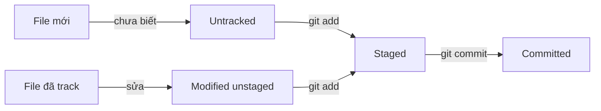

# `git status` — Xem trạng thái working directory

> **Tác giả:** Mr.Rom\
> **Phiên bản:** v1.1.0\
> **Tạo lúc:** 15/05/2026\
> **Cập nhật:** 01/06/2026\
> **Level:** Basic\
> **Tags:** [MUST-KNOW]\
> **Yêu cầu trước:** Đã cài Git, đã `git init` 1 repo (xem `00_setup.md`)

> 🎯 *`git status` là lệnh bạn dùng nhiều nhất trong git. Sau bài này bạn sẽ đọc được output của `git status`, biết file nào staged / unstaged / untracked.*

## 🎯 Sau bài này bạn sẽ

- [ ] Chạy được `git status` và đọc hiểu output
- [ ] Phân biệt 3 trạng thái file: untracked, modified (unstaged), staged
- [ ] Dùng flag phổ biến: `-s`, `-b`

---

## 1️⃣ Vì sao cần `git status` (WHY)

Khi làm việc với git, bạn luôn cần biết **"hiện đang có gì thay đổi, gì đã staged, gì chưa"** trước khi commit. `git status` trả lời chính xác câu hỏi đó.

Không có `git status` → commit mù → dễ commit nhầm file (vd: `.env` chứa secret) hoặc miss file cần thêm.

## 2️⃣ Git status là gì (WHAT)

`git status` show 4 thông tin:

1. **Branch hiện tại** đang ở
2. **File untracked** — file mới chưa được git theo dõi
3. **File modified, unstaged** — file đã track, có sửa, nhưng chưa `git add`
4. **File staged** — file đã `git add`, sẵn sàng commit



## 3️⃣ Cách dùng (HOW)

### 🛠️ Hands-on cơ bản

Trong 1 repo đã init, tạo file thử:

```bash
echo "hello" > test.txt
git status
```

Output mẫu:

```
On branch main

No commits yet

Untracked files:
  (use "git add <file>..." to include in what will be committed)
        test.txt

nothing added to commit but untracked files present (use "git add" to track)
```

→ `test.txt` là **untracked** (git chưa biết tới).

### 🛠️ Sau khi `git add`

```bash
git add test.txt
git status
```

```
On branch main

No commits yet

Changes to be committed:
  (use "git rm --cached <file>..." to unstage)
        new file:   test.txt
```

→ `test.txt` giờ **staged** (sẵn sàng commit).

### 🛠️ Sửa file đã track sau khi commit

```bash
git commit -m "add test.txt"
echo "world" >> test.txt
git status
```

```
On branch main
Changes not staged for commit:
  (use "git add <file>..." to update what will be committed)
  (use "git restore <file>..." to discard changes in working directory)
        modified:   test.txt
```

→ `test.txt` giờ **modified, unstaged**.

---

## ⚡ Tra cứu nhanh (Cheatsheet)

| Lệnh | Output |
|---|---|
| `git status` | Đầy đủ (default) |
| `git status -s` | Ngắn gọn (short format) |
| `git status -b` | Kèm branch info ở đầu |
| `git status -sb` | Ngắn + branch (hay dùng) |
| `git status --ignored` | Show cả file bị `.gitignore` ignore |

Format ngắn `-s`:

```
?? test.txt        # Untracked
 M test.txt        # Modified, unstaged
A  test.txt        # Added (staged)
M  test.txt        # Modified, staged
MM test.txt        # Modified staged + sửa thêm sau khi stage
```

→ Ký tự cột 1 = staged state, cột 2 = working tree state.

---

## 📚 Từ Điển Thuật Ngữ (Glossary)

| EN | VN | Giải thích |
|---|---|---|
| Working directory | Thư mục làm việc | Folder bạn đang edit file thực tế |
| Staging area (index) | Khu vực staging | Nơi tích trữ thay đổi trước khi commit |
| Untracked | Chưa theo dõi | File git chưa biết tới (mới tạo) |
| Tracked | Đã theo dõi | File git đang theo dõi |
| Staged | Đã staged | File đã `git add`, chờ commit |
| Modified | Đã sửa | File đã track, có thay đổi |
| Working tree | Cây thư mục làm việc | Snapshot file đang có trên disk (vs versions trong git) |

---

## 📌 Nhật ký thay đổi (Changelog)

- **v1.0.0 (15/05/2026)** — Bản đầu tiên — bài ngắn về `git status` (WHY/WHAT/HOW + cheatsheet).
- **v1.1.0 (01/06/2026)** — Việt hoá heading Cheatsheet/Glossary; bỏ câu dẫn meta-leak "Bài này test mẫu short lesson trong Blueprint"; đổi "Prerequisites" → "Yêu cầu trước"; heading changelog chuẩn + tăng dần. Lý do: bài mẫu giống file học phải sạch meta-leak + đồng bộ 3 quyết định governance.
