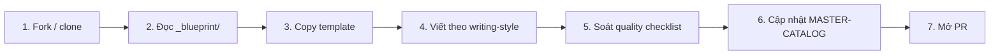

# 🤝 Contributing — <Tên kho>

> Cảm ơn bạn đã quan tâm đóng góp cho kho tri thức này! File này hướng dẫn cách contribute để giữ nhất quán với chuẩn của repo.

---

## 1️⃣ Quy trình đóng góp



| Bước | Chi tiết |
|---|---|
| 1 | Fork repo về tài khoản, clone về local |
| 2 | Đọc `_blueprint/` để hiểu cấu trúc + chuẩn viết (đặc biệt `README.md`) |
| 3 | Vào `_blueprint/templates/` copy template phù hợp loại bài |
| 4 | Viết theo `_blueprint/03_writing-style.md` (khung 8 phần, WHY→WHAT→HOW) |
| 5 | Soát qua `_blueprint/07_quality-checklist.md` — tick mọi mục |
| 6 | Cập nhật `MASTER-CATALOG.md` với entry bài mới (status: ✅/🚧) |
| 7 | Mở PR theo template (ngay trong repo) |

---

## 2️⃣ Cấu trúc PR

PR title format: `<type>: <description>`. Type: `feat` / `fix` / `docs` / `refactor` / `chore`.

Ví dụ:
- `feat: add Pod lesson basic`
- `fix: typo in deployment.md`
- `docs: update naming convention`

PR body nên có:

```markdown
## Tóm tắt
<1-3 câu mô tả PR làm gì>

## File thay đổi
- <list file mới/sửa>

## Quality checklist
- [ ] Đã soát theo `_blueprint/07_quality-checklist.md`
- [ ] Code mẫu đã test chạy
- [ ] Link nội bộ + external đã test
- [ ] Cập nhật MASTER-CATALOG.md
- [ ] Bump version file (nếu sửa file đã có)
```

---

## 3️⃣ Nội dung cần tránh (anti-patterns)

| ❌ Anti-pattern | 💡 Lý do |
|---|---|
| Bài thiếu câu dẫn — section nhảy ngang | Người đọc vấp khi đọc, mất flow |
| Code mẫu chưa test | Người đọc gặp lỗi, mất niềm tin vào kho |
| Heading tiếng Anh trong bài VN | Vi phạm ngôn ngữ chính của kho |
| Chèn ước tính thời gian (giờ/tuần/tháng/phút) vào bài | Repo bỏ hết ước tính thời gian — tạo expectation sai, khó bảo trì |
| Copy-paste từ nguồn khác không thêm value | Vi phạm Evergreen + DRY |
| Outdated content (vd: API version cũ) | Người đọc làm theo sẽ lỗi |
| Hardcode credential thật (password, API key) | Bảo mật |
| Hardcode đường dẫn tuyệt đối trên máy author | Người khác không chạy được |
| File rỗng không có placeholder | Git track nhưng vô dụng |
| Tag MUST-KNOW lạm dụng | Phá ý nghĩa của tag — chỉ ~20-30% bài là MUST-KNOW |
| Tạo loại nội dung mới ngoài 7 lõi mà không cập nhật Blueprint | Drift cấu trúc |

---

## 4️⃣ Badges level trong metadata

Mỗi bài lesson có Level trong metadata:

| Badge | Áp dụng cho |
|---|---|
| `Basic` | Beginner zero-base có thể hiểu |
| `Intermediate` | Đã biết cơ bản, học nâng cao 1 chút |
| `Advanced` | Chuyên sâu, cần nền vững |
| Tag `[MUST-KNOW]` | Bài bắt buộc trong roadmap tương ứng (vd: Pod cho DevOps roadmap) |

Chi tiết: `_blueprint/03_writing-style.md` §2.1.

---

## 5️⃣ Văn phong

| Nguyên tắc | Tham chiếu |
|---|---|
| Tiếng Việt có dấu, EN cho thuật ngữ | `_blueprint/03_writing-style.md` §3.1 |
| Xưng hô: tác giả = mình/Mr.Rom, đọc = bạn | `_blueprint/03_writing-style.md` §3.1 |
| Câu dẫn liền mạch | `_blueprint/03_writing-style.md` §3.3 |
| Cấm sáo rỗng | `_blueprint/03_writing-style.md` §3.4 |
| Khung 8 phần bài | `_blueprint/03_writing-style.md` §1 |
| WHY → WHAT → HOW | `_blueprint/03_writing-style.md` §2.3 |

---

## 6️⃣ Đặt tên

Tuân theo `_blueprint/02_folder-structure.md`. Tóm tắt:

- File: kebab-case, tiếng Anh, đánh số `NN_` nếu trong series
- Folder L1: `NN_Name/` (sentence case)
- Folder L2 trở xuống: `name/` (lowercase)
- Meta: prefix `_` (vd `_glossary.md`, `_notes/`)

---

## 7️⃣ Liên kết

Tuân theo `_blueprint/05_linking-strategy.md`. Tóm tắt:

- Internal: dùng relative path
- Link text mô tả đích — không "click here"
- Navigation footer cuối bài
- Cross-L2: dùng pattern 3-cách (đi từ stage trước / clone / build mới)
- Thuật ngữ EN: thêm vào glossary 3 cấp

---

## 8️⃣ Liên hệ

- Bug / suggestion: open Issue trong repo
- PR review: ping `@<owner>` trong PR
- Câu hỏi lớn: discussion ở Issues hoặc kênh team
