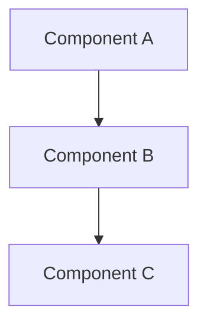

# <Tên bài học>

> **Tác giả:** Mr.Rom\
> **Phiên bản:** v1.1.0\
> **Tạo lúc:** DD/MM/YYYY\
> **Cập nhật:** 01/06/2026\
> **Level:** Basic | Intermediate | Advanced\
> **Tags:** <tag1>, <tag2> (vd: git, version-control)\
> **Yêu cầu trước:** [<bài tiên quyết>](../path/to/file.md) (nếu có)

> 🎯 *<Câu dẫn 1-2 dòng: Trước khi học X cần biết Y. Sau bài này bạn sẽ làm được Z.>*

## 🎯 Sau bài này bạn sẽ

- [ ] <Mục tiêu 1 — verb-phrase, đo lường được>
- [ ] <Mục tiêu 2>
- [ ] <Mục tiêu 3>
- [ ] <Mục tiêu 4>

---

## 1️⃣ <Concept — X là gì>

<Đoạn intro ngắn, định nghĩa concept bằng ngôn ngữ đơn giản.>

<Có thể có sub-point:>

- **Đặc điểm 1**: ...
- **Đặc điểm 2**: ...

> 💡 Hiểu định nghĩa rồi, ta xem cấu trúc qua diagram bên dưới để hình dung rõ hơn.

### Diagram



> 📖 *<Câu nối: "Diagram đã rõ, mình thử <action> ngay để thấy thực tế.">*

---

## 2️⃣ Hands-on — Thử ngay

### 🛠️ Bước 1: <Setup / chuẩn bị>

```bash
<lệnh setup>
```

Kết quả mong đợi:

```
<output mẫu>
```

### 🛠️ Bước 2: <Action chính>

```bash
<lệnh chính>
```

Kết quả:

```
<output>
```

> 📖 *<Câu nối: "Đã chạy được rồi, giờ ta phân tích kỹ output này.">*

### Giải thích output

- **Dòng 1** (`...`): ...
- **Dòng 2** (`...`): ...

---

## 3️⃣ <Concept nâng cao / use case>

<Nội dung mở rộng nếu có. Có thể có nhiều sub-section.>

---

## 💡 Cạm bẫy thường gặp & Best practice <!-- OPTIONAL -->

### ❌ Cạm bẫy: <tên cạm bẫy>
- **Triệu chứng**: ...
- **Nguyên nhân**: ...
- **Cách tránh**: ...

### ✅ Best practice: <tên best practice>
- **Vì sao**: ...
- **Cách áp dụng**: ...

---

## 🧠 Tự kiểm tra (Self-check) <!-- OPTIONAL -->

**Q1.** <Câu hỏi 1>

<details>
<summary>💡 Đáp án</summary>

<đáp án chi tiết>

</details>

**Q2.** <Câu hỏi 2>

<details>
<summary>💡 Đáp án</summary>

<đáp án>

</details>

---

## ⚡ Tra cứu nhanh (Cheatsheet) <!-- OPTIONAL -->

| Mục đích | Lệnh / Cú pháp |
|---|---|
| <Việc 1> | `<lệnh 1>` |
| <Việc 2> | `<lệnh 2>` |
| <Việc 3> | `<lệnh 3>` |

---

## 📚 Từ Điển Thuật Ngữ (Glossary) <!-- REQUIRED nếu có thuật ngữ EN -->

| EN | VN | Giải thích |
|---|---|---|
| <Term 1> | <VN dịch> | <Giải thích ≤25 từ> |
| <Term 2> | <VN dịch> | <...> |

---

## 🔗 Liên kết & Tài nguyên <!-- OPTIONAL -->

### 🧭 Định hướng lộ trình học

- ⬅️ **Bài trước:** [<tiêu đề thật của bài trước>](./<path>.md)
- ➡️ **Bài tiếp theo:** [<tiêu đề thật của bài tiếp>](./<path>.md)
- ↑ **Về cụm:** [<Tên cụm> — README cụm](../README.md)

### 🧩 Các chủ đề có thể bạn quan tâm

- [<tiêu đề thật của bài liên quan 1>](./<path>.md)
- [<tiêu đề thật của bài liên quan 2>](./<path>.md)

### 🌐 Tài nguyên tham khảo khác

- [<Tên tài nguyên>](<URL>) — <ngắn gọn lý do recommend>

---

## 📌 Nhật ký thay đổi (Changelog)

- **v1.0.0 (DD/MM/YYYY)** — Bản đầu tiên.
- **v1.1.0 (01/06/2026)** — Việt hoá heading kỹ thuật (Self-check/Cheatsheet/Pitfall/Glossary), đổi section Liên kết sang 3-sub + nav bullet 3-marker, đổi "Prerequisites" → "Yêu cầu trước" + thêm Tags, dùng heading changelog chuẩn + tăng dần. Lý do: đồng bộ với 3 quyết định governance đã duyệt.
