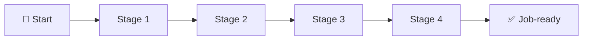

# 🧭 <Role> Career Roadmap
<!--
Template cho Career Roadmap. Đối với Lab Series, dùng roadmap_template.md bản này nhưng đổi header sang "🧪 <Series Name> Lab Series" và bỏ tab career-specific.
-->

> **Tác giả:** Mr.Rom\
> **Phiên bản:** v1.1.0\
> **Tạo lúc:** DD/MM/YYYY\
> **Cập nhật:** 01/06/2026\
> **Đối tượng:** <ai phù hợp với roadmap này>\
> **Mức độ:** Entry / Mid / Senior

> 🎯 *<Câu dẫn: "Sau lộ trình này bạn sẽ làm được X, đáp ứng yêu cầu phổ biến của vị trí Y.">*

---

## 🎯 Mục tiêu cuối cùng

Sau khi hoàn thành roadmap này, bạn sẽ:

- [ ] <Mục tiêu 1 — đo lường được, kiểm chứng được>
- [ ] <Mục tiêu 2>
- [ ] <Mục tiêu 3>
- [ ] <Mục tiêu 4>

## 🗺️ Overview các stage

| Stage | Tên | Output cuối stage |
|---|---|---|
| 1 | <Tên stage 1> | <output cụ thể> |
| 2 | <Tên stage 2> | <output> |
| 3 | <Tên stage 3> | <output> |
| 4 | <Tên stage 4> | <output> |

---

## Stage 1 — <Tên>

> 🎯 *<Mục tiêu stage: "Sau stage này bạn nắm được X trước khi bước sang stage 2.">*

### 📚 Lý thuyết cần đọc

- [ ] [<Topic 1>](../../<L1>/<L2>/lessons/01_basic/<file>.md)
- [ ] [<Topic 2>](../../<L1>/<L2>/lessons/01_basic/<file>.md)
- [ ] [<Topic 3>](../../<L1>/<L2>/lessons/01_basic/<file>.md)

### 🛠️ Setup môi trường <!-- nếu cần -->

- [ ] [<Setup A>](../../<L1>/<L2>/setup/<file>.md)
- [ ] [<Setup B>](../../<L1>/<L2>/setup/<file>.md)

### 🧪 Bài tập

- [ ] [<Exercise 01>](../../<L1>/<L2>/exercises/01_<name>.md)
- [ ] [<Exercise 02>](../../<L1>/<L2>/exercises/02_<name>.md)
- [ ] [<Exercise 03>](../../<L1>/<L2>/exercises/03_<name>.md)

### 🎯 Project cuối stage

- [ ] [<Project>](../../<L1>/<L2>/projects/01_<name>/) — <mục tiêu>

### ✅ Verify — Sau stage 1 bạn phải

- [ ] Trả lời được: "<câu hỏi key 1>"
- [ ] Tự build được: "<sản phẩm nhỏ>"
- [ ] Đọc được code dạng: "<dạng code>"

---

## Stage 2 — <Tên>

(lặp cấu trúc Stage 1)

---

## Stage 3 — <Tên>

(...)

---

## Stage 4 — <Tên>

(...)

---

## 📌 Tài nguyên bổ sung

### Sách

| Tên sách | Tác giả | Tại sao đọc |
|---|---|---|
| <Tên> | <Author> | <Reason> |

### Khóa học (paid hoặc free đáng giá)

| Khoá | Nền tảng | Tại sao |
|---|---|---|
| <Tên> | <Coursera/Udemy/...> | <Reason> |

### Cộng đồng / Diễn đàn

- [<Discord/Reddit/Slack>](<URL>) — <vì sao tham gia>

---

## 🔄 Khi nào điều chỉnh roadmap

| Tình huống | Hành động |
|---|---|
| Đã biết Stage 1 → muốn skip | Làm Verify checklist Stage 1 — pass thì skip |
| Stage 2 quá nhanh | Thêm side project tự chọn (xem [`projects/`](../../<L1>/projects/)) |
| Stage 3 không phù hợp định hướng | Đổi sang roadmap khác: [<Roadmap khác>](./<other>_career-roadmap.md) |
| Thấy mình đi chậm | Đó là bình thường — ưu tiên hiểu kỹ, không vội |

---

## 📌 Nhật ký thay đổi (Changelog)

- **v1.0.0 (DD/MM/YYYY)** — Bản đầu tiên.
- **v1.1.0 (01/06/2026)** — Bỏ mọi ước tính thời gian (field "Thời gian ước tính", cột "Thời gian" bảng stage, "(<thời gian>)" ở stage header, annotation "X phút" per-link, dòng "chậm hơn ước tính"); dùng heading changelog chuẩn + tăng dần. Lý do: đồng bộ với 3 quyết định governance đã duyệt (bỏ hết ước tính thời gian).
