# 💡 Ý tưởng — Repo Tri thức CNTT toàn diện bằng tiếng Việt

> **Tác giả:** Mr.Rom\
> **Phiên bản:** v0.2.0 (bản phác thảo)\
> **Tạo lúc:** 15/05/2026\
> **Cập nhật:** 15/05/2026

> 📌 *Đây là bản phác thảo ý tưởng — chưa phải spec triển khai. Mọi quyết định bên dưới đều có thể điều chỉnh khi đi vào thực tế. Mọi thay đổi lớn sẽ được ghi vào mục "Changelog ý tưởng" cuối file.*

---

## 🎯 Mục đích

Xây dựng **một kho dữ liệu (repo) tổng hợp toàn bộ kiến thức Công nghệ thông tin** bằng tiếng Việt, đóng vai trò:

- 📖 **Sổ tay tự học cá nhân** — nơi ghi chép, đào sâu, hệ thống hóa kiến thức.
- 🌏 **Tài liệu mở cho cộng đồng VN** — đặc biệt phục vụ người mới và người chuyển ngành.
- 🔍 **Nguồn tra cứu trọn đời** — học mới được, ôn lại cũng được, tra cứu nhanh cũng được.

---

## 👥 Đối tượng người đọc

Một file/bài học phải phục vụ **4 nhóm cùng lúc**:

| Nhóm                     | Đặc điểm                      | Họ đọc gì trong bài                               |
| ------------------------ | ----------------------------- | ------------------------------------------------- |
| 🟢 **Beginner zero-base** | Chưa biết gì về IT            | Đọc tuần tự từ đầu → cuối, theo câu dẫn liền mạch |
| 🟡 **Người chuyển ngành** | Đã có nền IT, học mảng mới    | Phần overview + ví dụ thực tế                     |
| 🟠 **Senior ôn lại**      | Đã làm lâu, quên kiến thức cũ | Nhảy thẳng cheatsheet & glossary                  |
| 🔵 **Tra cứu nhanh**      | Đang làm việc, cần lời giải   | Glossary / cheatsheet / lệnh mẫu                  |

→ **Hệ quả thiết kế**: mỗi bài phải có *nhiều tầng đọc* (multi-layer) để đáp ứng cả 4 nhóm trong cùng một file.

---

## 📦 Phạm vi

> 🎯 **Toàn bộ các nhóm kiến thức CNTT** — không bó hẹp ở bất kỳ mảng nào.

### Chiến lược tránh "tham vọng quá lớn → bỏ dở"

| Yếu tố                | Quyết định                                                                    |
| --------------------- | ----------------------------------------------------------------------------- |
| **Sitemap (khung)**   | Thiết kế **đầy đủ 100% ngay từ đầu** — folder rỗng cũng được                  |
| **Nội dung (ruột)**   | Viết **theo nhu cầu thực tế** — học/làm tới đâu, viết tới đó                  |
| **Mức độ hoàn thiện** | Không bắt buộc viết hết — kho phát triển liên tục, không có "ngày hoàn thành" |

---

## 🏗️ Cấu trúc kho

### Sitemap Level 1 — 16 chủ đề + 1 Roadmap

```mermaid
graph TD
    R[🗺️ 00_Roadmaps<br/>các lộ trình học]

    R --> B[Nền tảng]
    R --> C[Ngôn ngữ lập trình]
    R --> D[Hệ thống]
    R --> E[Ứng dụng]
    R --> F[Vận hành]
    R --> G[Chuyên sâu]
    R --> H[Nghề nghiệp]

    B --> B1[01_Foundations<br/>DS&A, OS theory, CS basics]
    B --> B2[02_Tools<br/>Git, Shell, Editor, Productivity]

    C --> C1[03_Languages<br/>Python, Go, JS/TS, Rust, ...]

    D --> D1[04_OS<br/>Linux, MacOS, Windows]
    D --> D2[05_Networking<br/>TCP/IP, HTTP, DNS, ...]
    D --> D3[06_Databases<br/>SQL, NoSQL, Vector DB]

    E --> E1[07_Web<br/>Frontend + Backend + API]
    E --> E2[08_Mobile<br/>iOS, Android, Cross-platform]
    E --> E3[09_Architecture<br/>Design patterns, System design]

    F --> F1[10_DevOps<br/>Docker, K8s, CI/CD, IaC, Observability]
    F --> F2[11_Cloud<br/>AWS, GCP, Azure]
    F --> F3[12_Security<br/>Cybersec, Crypto, Auth]

    G --> G1[13_AI-ML<br/>ML, DL, LLM, GenAI]
    G --> G2[14_Data-Engineering<br/>ETL, Warehouse, Streaming]
    G --> G3[15_Specialized<br/>Game, Embedded, Blockchain, IoT, ...]

    H --> H1[16_Career-Soft-skills<br/>Communication, Agile, Career path]
```



#### Danh sách chi tiết

| #   | Chủ đề L1            | Nội dung chính                                                    |
| --- | -------------------- | ----------------------------------------------------------------- |
| 00  | **Roadmaps**         | Tập hợp các lộ trình học (Backend, DevOps, Frontend, Data, AI...) |
| 01  | **Foundations**      | Cấu trúc dữ liệu, giải thuật, lý thuyết OS, kiến trúc máy tính    |
| 02  | **Tools**            | Git, Shell (Bash/Zsh), Editor (VSCode/Vim), tooling cá nhân       |
| 03  | **Languages**        | Python, Go, JS/TS, Rust, C/C++, Java, ...                         |
| 04  | **OS**               | Linux, MacOS, Windows                                             |
| 05  | **Networking**       | TCP/IP, HTTP, DNS, Load balancing, Network security               |
| 06  | **Databases**        | SQL (PostgreSQL, MySQL), NoSQL (MongoDB, Redis), Vector DB        |
| 07  | **Web**              | Frontend (React, Vue), Backend (Node, FastAPI, ...), REST/GraphQL |
| 08  | **Mobile**           | iOS, Android, React Native, Flutter                               |
| 09  | **Architecture**     | Design patterns, System design, Microservices, DDD                |
| 10  | **DevOps**             | Docker, Kubernetes, CI/CD, IaC (Terraform, Ansible), Observability (Prometheus, Grafana, ELK) |
| 11  | **Cloud**              | AWS, GCP, Azure, multi-cloud                                      |
| 12  | **Security**           | Cybersecurity, Cryptography, Auth, OWASP                          |
| 13  | **AI-ML**              | Machine Learning, Deep Learning, LLM, GenAI, Agent                |
| 14  | **Data-Engineering**   | ETL/ELT, Data warehouse, Streaming (Kafka, Spark)                 |
| 15  | **Specialized**        | Game dev, Embedded, Blockchain, IoT, Quantum, ...                 |
| 16  | **Career-Soft-skills** | Communication, Agile/Scrum, Career path (Intern → Senior → Architect), học cách học, đọc tài liệu |

### Cấu trúc Level 2 — chuẩn nội bộ trong mỗi chủ đề

```
<chủ-đề>/
├── README.md                ← index của chủ đề, link chéo
├── 00_overview.md           ← chủ đề này là gì, dùng làm gì, vì sao học
├── 01_basic/                ← beginner zero-base
│   ├── 00_<concept>.md
│   ├── 01_<concept>.md
│   └── ...
├── 02_intermediate/         ← đã biết cơ bản
├── 03_advanced/             ← nâng cao, chuyên sâu
├── 99_cheatsheet.md         ← bảng tra cứu nhanh
└── _glossary.md             ← thuật ngữ EN ↔ VN
```

### 🗺️ Cơ chế Roadmap

`00_Roadmaps/` **không chứa kiến thức** — chỉ chứa **lộ trình học**, mỗi file dẫn người đọc đi xuyên qua các chủ đề L1 theo thứ tự đã thiết kế.

```
00_Roadmaps/
├── README.md                            ← danh sách tất cả roadmap
├── zero-to-coder_roadmap.md             ← bắt đầu từ con số 0
├── backend-developer_roadmap.md
├── frontend-developer_roadmap.md
├── fullstack-developer_roadmap.md
├── devops-engineer_roadmap.md
├── cloud-engineer_roadmap.md
├── data-engineer_roadmap.md
├── ai-engineer_roadmap.md
├── mobile-developer_roadmap.md
└── security-engineer_roadmap.md
```

#### Mẫu một roadmap file

```markdown
# Backend Developer Roadmap (lộ trình 6-12 tháng)

## 🎯 Sau lộ trình này bạn làm được gì
- ...

## Bước 1 — Nền tảng (1-2 tháng)
- [ ] [Linux cơ bản](../04_OS/Linux/01_basic/)
- [ ] [Git](../01_Foundations/version-control/git/)
- [ ] [Python cơ bản](../03_Languages/python/01_basic/)

## Bước 2 — Database (1 tháng)
- [ ] [SQL cơ bản](../06_Databases/postgresql/01_basic/)
...
```

→ Roadmap = **layer điều hướng**, kiến thức gốc vẫn nằm ở các chủ đề L1 tương ứng (DRY — không lặp nội dung).

---

## ✍️ Chuẩn viết nội dung

### Khung chuẩn 8 phần — linh hoạt (REQUIRED / OPTIONAL)

> 📌 Mọi bài học **theo khung này** để có cấu trúc nhất quán. Phần `REQUIRED` bắt buộc có; phần `OPTIONAL` chỉ thêm khi nội dung bài cần — *không có thì bỏ qua*, không cần "chế cháo" cho đủ. Mục đích: bài đa dạng, người viết có roadmap khi cần.

| #   | Phần                          | Vai trò                                                         | Yêu cầu        | Phục vụ nhóm     |
| --- | ----------------------------- | --------------------------------------------------------------- | -------------- | ---------------- |
| 1   | 📋 **Metadata**                | Số bài, module, level (basic/inter/advanced), thời lượng đọc, prerequisites, ngày cập nhật | ✅ REQUIRED   | Tất cả           |
| 2   | 🎯 **Câu dẫn + Mục tiêu**      | *"Trước khi học X cần biết Y. Sau bài này bạn làm được Z."* + checklist mục tiêu đạt được | ✅ REQUIRED   | Tất cả           |
| 3   | 📖 **Nội dung chính**          | Lý thuyết → Diagram → Ví dụ → Giải thích từng dòng (hands-on có thể tích hợp tại đây) | ✅ REQUIRED   | Beginner         |
| 4   | 💡 **Pitfall & Best practice** | Lỗi thường gặp + cách tránh + best practice                     | 🟡 OPTIONAL    | Intermediate     |
| 5   | 🧠 **Self-check**              | Câu hỏi ôn tập kèm đáp án ẩn (`<details>`)                      | 🟡 OPTIONAL    | Beginner / Inter |
| 6   | ⚡ **Cheatsheet**              | Bảng lệnh / cú pháp tra cứu nhanh                                | 🟡 OPTIONAL    | Senior / tra cứu |
| 7   | 📚 **Glossary**                | Thuật ngữ EN ↔ VN ↔ giải thích                                  | ✅ REQUIRED (nếu có thuật ngữ EN) | Tất cả           |
| 8   | 🔗 **Liên kết & Tài nguyên**   | Bài tiên quyết, bài liên quan, tài nguyên ngoài                  | 🟡 OPTIONAL    | Tất cả           |

#### Khi nào áp dụng phần OPTIONAL

| Phần | Áp dụng khi… |
|---|---|
| Pitfall | Bài có khái niệm dễ nhầm / lệnh dễ sai cú pháp |
| Self-check | Bài đủ sâu để có nội dung kiểm tra (concept lớn, không phải quick note) |
| Cheatsheet | Bài có nhiều lệnh / nhiều cú pháp người đọc sẽ tra lại |
| Liên kết | Có bài liên quan trong kho, hoặc tài nguyên ngoài đáng tin cậy |

> ⚠️ **Bài ngắn / quick note** có thể chỉ dùng 3 phần REQUIRED (Metadata + Câu dẫn + Nội dung). Bài chuyên sâu nên dùng cả 8 phần.

### Nguyên tắc viết

- **Liền mạch — có câu dẫn**: giữa các section phải có câu bắc cầu (*"Hiểu Pod rồi, giờ ta xem cách Pod được quản lý qua Deployment..."*) — đây chính là thứ blog VN thiếu nhất.
- **Hands-on first**: mọi concept có lệnh `copy-paste để thử ngay`, không bỏ bước (khi bài có tính thực hành).
- **Visualize mọi thứ có thể**: mermaid cho flow/quan hệ, ASCII cho cấu trúc đơn giản, screenshot cho UI.
- **Một file = một bài học hoàn chỉnh**: đọc xong file là hiểu một topic, không bắt buộc phải mở file khác.
- **Beginner-friendly là mặc định**: giả định người đọc *không biết gì* về topic đó.

---

## 🌐 Ngôn ngữ & thuật ngữ

| Quy tắc                    | Chi tiết                                                                              |
| -------------------------- | ------------------------------------------------------------------------------------- |
| **Ngôn ngữ chính**         | Tiếng Việt có đầy đủ dấu (UTF-8 NFC)                                                  |
| **Thuật ngữ chuyên ngành** | Giữ nguyên tiếng Anh, *in nghiêng lần đầu xuất hiện*, kèm giải nghĩa ngắn trong ngoặc |
| **Tên file / biến / lệnh** | Tiếng Anh (theo convention chung)                                                     |
| **Glossary cuối file**     | Bảng `EN ↔ VN ↔ giải thích` cho mọi thuật ngữ đã dùng trong file                      |

---

## 🌱 Chiến lược phát triển

### Phase 0 — Đặt nền móng (1-2 tuần)
1. Tạo skeleton folder cho 16 chủ đề L1 + 00_Roadmaps (folder rỗng + README placeholder)
2. Viết `_TEMPLATE_lesson.md` — template chuẩn cho mọi bài học
3. Viết `README.md` gốc — giới thiệu kho, hướng dẫn dùng
4. Soạn ít nhất **1 roadmap** đầu tiên (gợi ý: `zero-to-coder` hoặc roadmap của mảng bạn đang mạnh)

### Phase 1 — Nội dung lõi (liên tục)
- Viết theo nhu cầu học/làm — học gì viết nấy
- Mỗi tuần đặt mục tiêu mềm: tối thiểu 1-2 bài hoàn chỉnh
- Tận dụng nội dung đã có ở `04_Knowledge/_Ref/` (như folder K8s) — chuẩn hóa lại theo template

### Phase 2 — Mở rộng cộng đồng (khi kho đủ chín)
- Đưa repo lên GitHub public
- Viết `CONTRIBUTING.md`, quy trình review
- Kêu gọi đóng góp

---

## 🤝 Đóng góp

- **Người duy trì chính**: Mr.Rom (chủ kho)
- **Người đóng góp**: bất kỳ ai muốn — sau khi kho được public hóa ở Phase 2
- **Cơ chế**: Pull Request + review (chi tiết quy trình sẽ định nghĩa khi tới Phase 2)

---

## 📌 Changelog ý tưởng

- **v0.2.0 (15/05/2026)** — Tinh chỉnh sau khi khảo sát `_Ref/` (đặc biệt `K8s-training/`):
  - Thêm chủ đề L1 #16 **Career-Soft-skills** (Communication, Agile, Career path) — phục vụ nhóm "người chuyển ngành".
  - Mở rộng L1 #10 DevOps thêm **Observability** (Prometheus, Grafana, ELK).
  - Mở rộng L1 #15 Specialized thêm **IoT**.
  - Nâng khung viết từ **5 → 8 phần** với cờ REQUIRED/OPTIONAL (học từ cấu trúc K8s-training): thêm Metadata, Self-check, Liên kết & Tài nguyên — bài lớn dùng đủ, bài nhỏ chỉ dùng phần REQUIRED.
- **v0.1.0 (15/05/2026)** — Bản phác thảo đầu tiên. Chốt: mục đích, 4 nhóm audience, scope toàn bộ CNTT, sitemap 15 chủ đề L1 + Roadmaps, cấu trúc L2, chuẩn viết 5 phần, chiến lược 3 phase.
